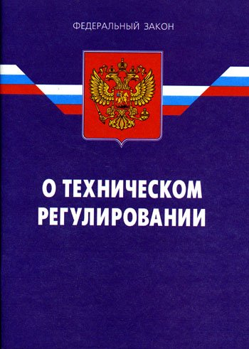

## Статья 1. Сфера применения настоящего Федерального закона.
 Настоящий Федеральный закон регулирует отношения, возникающие при: разработке, принятии, применении и исполнении обязательных требований к продукции, в том числе зданиям и сооружениям (далее - продукция), или к продукции и связанным с требованиями к продукции процессам проектирования (включая изыскания), производства, строительства, монтажа, наладки, эксплуатации, хранения, перевозки, реализации и утилизации;
## Статья 2. Основные понятия.
 безопасность продукции и связанных с ней процессов производства, эксплуатации, хранения, перевозки, реализации и утилизации (далее - безопасность) - состояние, при котором отсутствует недопустимый риск, связанный с причинением вреда жизни или здоровью граждан, имуществу физических или юридических лиц, государственному или муниципальному имуществу, окружающей среде, жизни или здоровью животных и растений;
## Статья 3. Принципы технического регулирования.
 Техническое регулирование осуществляется в соответствии с принципами: применения единых правил установления требований к продукции или к продукции и связанным с требованиями к продукции процессам проектирования (включая изыскания), производства, строительства, монтажа, наладки, эксплуатации, хранения, перевозки, реализации и утилизации, выполнению работ или оказанию услуг
## Статья 4. Законодательство Российской Федерации о техническом регулировании.
 Законодательство Российской Федерации о техническом регулировании состоит из настоящего Федерального закона, принимаемых в соответствии с ним федеральных законов и иных нормативных правовых актов Российской Федерации.
## Статья 5. Особенности технического регулирования в отношении оборонной продукции и других специальных случаев.
 В отношении оборонной продукции (работ, услуг), поставляемой по государственному оборонному заказу; продукции (работ, услуг), используемой в целях защиты сведений, составляющих государственную тайну или относимых к охраняемой в соответствии с законодательством Российской Федерации иной информации ограниченного доступа;
## Статья 5.1. Особенности технического регулирования в области обеспечения безопасности зданий и сооружений.
 Особенности технического регулирования в области обеспечения безопасности зданий и сооружений устанавливаются Федеральным законом "Технический регламент о безопасности зданий и сооружений".
## Статья 5.2. Уникальные черты технического регулирования в инновационном центре "Сколково".
 Особенности технического регулирования в области обеспечения безопасности продукции, а также процессов проектирования (включая изыскания), производства, строительства, монтажа, наладки, эксплуатации, хранения, перевозки, реализации и утилизации, применяемых на территории инновационного центра "Сколково", устанавливаются Федеральным законом "Об инновационном центре "Сколково".
## Статья 5.3. Особенности технического регулирования в сфере медицинских кластеров.
 Особенности технического регулирования в области обеспечения безопасности продукции, а также процессов проектирования (включая изыскания), производства, строительства, монтажа, наладки, эксплуатации, хранения, перевозки, реализации и утилизации, применяемых на территории международного медицинского кластера, устанавливаются Федеральным законом "О международном медицинском кластере и внесении изменений в отдельные законодательные акты Российской Федерации".
## Статья 5.4. Условия технического регулирования в случае ограниченной городской застройки.
 Особенности технического регулирования при подготовке документации по планировке территории, осуществлении архитектурно-строительного проектирования, строительства, реконструкции объектов капитального строительства в условиях стесненной городской застройки могут устанавливаться федеральными законами с учетом особенностей технического регулирования в области обеспечения безопасности зданий и сооружений, установленных Федеральным законом "Технический регламент о безопасности зданий и сооружений".
## Статья 5.4-1. Особенности технического регулирования на федеральной территории "Сириус".
 Особенности технического регулирования при подготовке документации по планировке территории, осуществлении архитектурно-строительного проектирования, строительства, реконструкции объектов капитального строительства в границах федеральной территории "Сириус" могут устанавливаться актами органов публичной власти федеральной территории "Сириус" с учетом особенностей технического регулирования в области обеспечения безопасности зданий и сооружений, установленных Федеральным законом от 30 декабря 2009 года N 384-ФЗ "Технический регламент о безопасности зданий и сооружений".
## Статья 5.5. Особенности технического регулирования в инновационных научно-технологических центрах.
 Особенности технического регулирования в области обеспечения безопасности продукции, а также процессов проектирования (включая изыскания), производства, строительства, монтажа, наладки, эксплуатации, хранения, перевозки, реализации и утилизации, применяемых на территориях инновационных научно-технологических центров, устанавливаются Федеральным законом "Об инновационных научно-технологических центрах и о внесении изменений в отдельные законодательные акты Российской Федерации".
## Статья 5.6. Уникальные черты технического регулирования в области космической деятельности.
 Особенности технического регулирования в области космической деятельности устанавливаются Законом Российской Федерации от 20 августа 1993 года N 5663-1 "О космической деятельности".
## Статья 6. Цели принятия технических регламентов.
 Технические регламенты принимаются в целях: защиты жизни или здоровья граждан, имущества физических или юридических лиц, государственного или муниципального имущества; охраны окружающей среды, жизни или здоровья животных и растений;предупреждения действий, вводящих в заблуждение приобретателей, в том числе потребителей;
## Статья 7. Содержание и применение технических регламентов.
 Технические регламенты с учетом степени риска причинения вреда устанавливают минимально необходимые требования, обеспечивающие:
 безопасность излучений;биологическую безопасность;взрывобезопасность;механическую безопасность;пожарную безопасность;
 безопасность продукции (технических устройств, применяемых на опасном производственном объекте);
## Статья 9. Порядок создания, утверждения, изменения и аннулирования технического регламента.
 В данной статье описывается процедура разработки, утверждения, изменения и отмены технических регламентов. Она указывает, что технический регламент может быть утвержден на основе международных соглашений или в соответствии с российским законодательством. Любое лицо может быть разработчиком проекта технического регламента, и уведомление о разработке должно быть опубликовано в федеральном органе по техническому регулированию. Срок для общественного обсуждения проекта технического регламента должен составлять не менее двух месяцев, и экспертную оценку проектов технических регламентов проводят экспертные комиссии по техническому регулированию. Если технический регламент не соответствует, Правительство Российской Федерации или федеральный орган исполнительной власти обязаны начать процедуру внесения изменений или отмены данного технического регламента.
## Статья 9.1. Процедура создания, утверждения, изменения и аннулирования технического регламента, утвержденного нормативным актом федерального органа исполнительной власти по техническому регулированию.
 Эта статья определяет процедуру разработки, утверждения, изменения и отмены технических регламентов, которые утверждаются нормативными актами федерального органа исполнительной власти по техническому регулированию. Она подчеркивает, что проект такого регламента должен быть представлен с обоснованием и экономическим обоснованием, а заключение экспертной комиссии о возможности утверждения регламента должно быть опубликовано и размещено в информационной системе. Утвержденные технические регламенты должны быть опубликованы и размещены в информационной системе, и они подлежат государственной регистрации, а также могут быть изменены или аннулированы в соответствии с установленной процедурой.
## Статьи 8, 11, 12, 13, 14, 15 и 16. Утратили силу.
 Эти статьи утратили свою юридическую силу с определенными датами. Статьи 8, 11, 12, 13, 14, 15 и 16 больше не применяются с 1 мая 2007 года и 1 июля 2016 года в соответствии с соответствующими Федеральными законами.
## Статья 16.1. Процедура формирования списка стандартизации.
 В данной статье описывается процесс создания списка документов по стандартизации, которые могут использоваться по желанию для обеспечения соблюдения требований технических регламентов. Федеральный орган исполнительной власти утверждает этот список, включая национальные стандарты, сборники правил, международные, региональные и иностранные стандарты. В этих документах могут содержаться требования, соблюдение которых гарантирует соответствие техническим регламентам. Регистрация международных, региональных и иностранных стандартов осуществляется в Федеральном информационном фонде технических регламентов и стандартов. Документы по стандартизации должны периодически обновляться и пересматриваться не реже одного раза в пять лет.
## Статья 16.2. Утратила силу.
 Согласно Федеральному закону от 05.04.2016 года №104-ФЗ, эта статья перестала действовать с 1 июля 2016 года.
## Статья 17. Утратила силу.
 Также в соответствии с тем же Федеральным законом от 05.04.2016 года №104-ФЗ, эта статья утратила свою силу с 1 июля 2016 года.
## Статья 18. Цели подтверждения соответствия.
 Эта статья устанавливает цели процедуры подтверждения соответствия, включая обеспечение соответствия продукции, процессов и объектов требованиям технических регламентов и стандартов, помощь потребителям в выборе продукции, увеличение конкурентоспособности на рынке и обеспечение свободного перемещения товаров.
## Статья 19. Принципы подтверждения соответствия.
 В данной статье устанавливаются основные принципы процедуры подтверждения соответствия, включая доступность информации, необязательность проведения процедуры без установленных требований, разработку методов и форм подтверждения соответствия, сокращение времени и затрат, отсутствие принудительных мер по добровольной сертификации и другие принципы.
## Статья 20. Формы подтверждения соответствия.
 В этой статье детально описываются различные способы подтверждения соответствия, включая добровольное и обязательное подтверждение. Добровольное подтверждение соответствия проводится по желанию заявителя и регулируется соглашением между заявителем и органом по сертификации. Обязательное подтверждение соответствия осуществляется в форме декларирования соответствия и обязательной сертификации. Порядок применения обязательных форм подтверждения соответствия устанавливается федеральным законодательством.
## Статья 21. Добровольное подтверждение соответствия.
 Эта статья более подробно рассматривает процедуру добровольного подтверждения соответствия, которая проводится по инициативе заявителя. Орган по сертификации подтверждает соответствие объектов добровольного подтверждения и выдает соответствующие сертификаты. Добровольное подтверждение соответствия может применяться к разным видам продукции, процессов, работ и услуг, и системы добровольной сертификации могут создаваться разными юридическими лицами. Федеральный орган исполнительной власти по техническому регулированию ведет реестр зарегистрированных систем добровольной сертификации.
## Статья 22. Знаки соответствия.
Эта статья регламентирует использование знака соответствия на объектах сертификации, которые прошли процедуру добровольной сертификации в соответствующей системе. Порядок применения этого знака определяется правилами системы добровольной сертификации. Статья также указывает, что объекты, чье соответствие не подтверждено в соответствии с законодательством, не могут быть маркированы знаком соответствия.
## Статья 23. Обязательное подтверждение соответствия.
Эта статья устанавливает принципы обязательного подтверждения соответствия продукции требованиям технических регламентов. Обязательное подтверждение проводится только в случаях, предусмотренных техническими регламентами, и только для продукции, предназначенной для обращения на территории России. Форма и схемы обязательного подтверждения соответствия определяются соответствующими техническими регламентами. Статья также говорит о равной юридической силе декларации о соответствии и сертификата соответствия на всей территории России, а также устанавливает порядок формирования и ведения реестра сертификатов соответствия и деклараций о соответствии.
## Статья 24. Декларирование соответствия.
Эта статья описывает процедуру декларирования соответствия продукции требованиям технических регламентов. Декларирование может проводиться на основе собственных доказательств или с участием органа по сертификации и аккредитованной лаборатории. Заявителем может быть юридическое или физическое лицо, или лицо, выполняющее функции иностранного изготовителя. Статья также определяет состав документации и срок действия декларации о соответствии.
## Статья 25. Обязательная сертификация.
Эта статья регулирует обязательную сертификацию продукции, при которой заявитель заключает договор с органом по сертификации для подтверждения соответствия продукции требованиям технических регламентов. Сертификат соответствия подтверждает, что продукция соответствует данным требованиям. Статья также указывает, что сертификат может выдаваться как на серийно выпускаемую продукцию, так и на отдельные партии или единичные экземпляры, и определяет срок действия сертификата и другие аспекты этой процедуры.
## Статья 26. Организация обязательной сертификации.
Эта статья описывает организацию обязательной сертификации и устанавливает, что эту процедуру проводят аккредитованные органы по сертификации. Органы по сертификации привлекают аккредитованные испытательные лаборатории для проведения необходимых исследований и измерений. Статья также устанавливает ответственность органов по сертификации за качество и объективность проведенных оценок, а также указывает на необходимость ведения реестра выданных сертификатов соответствия.
## Статья 27. Знак обращения на рынке.
В данной статье устанавливаются правила маркировки продукции, которая подлежит обязательному подтверждению соответствия. Важно отметить, что до 1 сентября 2023 года допускается ввоз продукции без маркировки на территорию Российской Федерации, но маркировка должна быть выполнена до реализации продукции потребителям. Знак обращения на рынке используется для информационных целей и наносится изготовителем или заявителем. Особенности маркировки определяются техническими регламентами, и продукция, не подтвержденная в соответствии с законодательством, не может быть маркирована этим знаком.
## Статья 28. Права и обязанности заявителя в области обязательного подтверждения соответствия.
Эта статья устанавливает права и обязанности заявителя при проведении обязательного подтверждения соответствия продукции требованиям технических регламентов. Заявитель имеет право выбирать форму и схему подтверждения соответствия, но также обязан обеспечивать соответствие продукции этим требованиям и указывать сведения о сертификате или декларации соответствия в сопроводительной документации. Он также обязан уведомлять орган по сертификации о любых изменениях в технической документации или производственных процессах. Заявитель имеет право приостановить или прекратить реализацию продукции, если сертификат или декларация были признаны недействительными.
## Статья 29. Условия ввоза в Российскую Федерацию продукции, подлежащей обязательному подтверждению соответствия.
Эта статья определяет условия ввоза в Россию продукции, требующей обязательного подтверждения соответствия. В частности, она указывает, что для помещения такой продукции под таможенные процедуры, предусматривающие отчуждение или использование на территории России, необходимо представить декларацию о соответствии или сертификат соответствия. Правительство России утверждает списки продукции, на которую распространяются требования технических регламентов, а таможенные органы выпускают такую продукцию без представления документов о соответствии.
## Статья 30. Признание результатов подтверждения соответствия.
Эта статья регулирует признание результатов подтверждения соответствия продукции, полученных за пределами России. Документы, знаки соответствия, протоколы исследований и измерений могут быть признаны в соответствии с международными договорами России.
## Статья 31. Аккредитация органов по сертификации и испытательных лабораторий (центров).
Эта статья устанавливает порядок аккредитации органов по сертификации и испытательных лабораторий. Аккредитацию проводит национальный орган по аккредитации, и этот орган также имеет право признавать документы, выданные аккредитованными испытательными лабораториями, недействительными. Порядок взаимодействия органов контроля и национального органа по аккредитации определяется Правительством России.
## Статья 31.1. Утратила силу.
Эта статья утратила свою силу с 1 июля 2014 года.
## Статья 32. Государственный контроль (надзор) за соблюдением требований технических регламентов.
 В данной статье регламентируется государственный контроль за соблюдением требований технических регламентов на разных этапах обращения продукции. Органы контроля осуществляют контрольные мероприятия на основе положений о видах контроля, указывая наименование и структурные элементы технических регламентов и виды продукции. Контрольные мероприятия проводятся с использованием правил и методов исследований, установленных для соответствующих технических регламентов. Изготовитель продукции может предложить использовать свои правила и методы исследований, но орган контроля может отказать в этом случае. Решение органа контроля может быть обжаловано в судебном порядке.
## Статья 33. Утратила силу.
Эта статья утратила свою силу с 1 июля 2021 года.
## Статья 34. Полномочия органов государственного контроля (надзора).
В данной статье определены полномочия органов государственного контроля (надзора) в области обеспечения соблюдения требований технических регламентов. Органы контроля имеют право запрашивать информацию о сертификатах соответствия и декларациях о соответствии. Они проводят контрольные (надзорные) мероприятия в соответствии с законодательством, могут выдавать предписания об устранении нарушений требований технических регламентов и имеют право приостанавливать или прекращать действие сертификатов соответствия и деклараций о соответствии. Органы контроля также могут привлекать к ответственности изготовителей (продавцов) за нарушение требований технических регламентов и требовать доказательственных материалов и других документов.
## Статья 35. Ответственность органов государственного контроля (надзора) и их должностных лиц.
Эта статья определяет ответственность органов государственного контроля и их должностных лиц за ненадлежащее исполнение обязанностей и противоправные действия. В случае нарушения законодательства Российской Федерации, органы государственного контроля обязаны сообщить о мерах, принятых в отношении виновных должностных лиц.
## Статья 36. Ответственность за несоответствие продукции или связанных с требованиями к ней процессов.
Эта статья устанавливает ответственность изготовителя в случае несоответствия продукции требованиям технических регламентов или нарушения требований при производстве. Изготовитель несет ответственность перед законом Российской Федерации и обязан возмещать вред, причиненный гражданам, имуществу или окружающей среде. Обязанность возмещения вреда не может быть ограничена договором или заявлением одной из сторон, и никакие соглашения об ограничении ответственности не действительны.
## Статья 37. Информация о несоответствии продукции требованиям технических регламентов.
Эта статья определяет процедуры уведомления об информации о несоответствии продукции требованиям технических регламентов. Изготовитель обязан сообщить об этом органу контроля в течение 10 дней, а продавец должен уведомить изготовителя в течение того же срока. Другие лица также имеют право направить информацию о несоответствии в орган контроля, который обязан уведомить изготовителя в течение 5 дней.
## Статья 38. Обязанности изготовителя (продавца, лица, выполняющего функции иностранного изготовителя) в случае получения информации о несоответствии продукции требованиям технических регламентов.
Эта статья регулирует действия изготовителя и других лиц, если они получают информацию о несоответствии продукции требованиям технических регламентов. Изготовитель обязан провести проверку информации в течение 10 дней и, если информация достоверна, разработать программу мероприятий по предотвращению вреда и согласовать ее с органом государственного контроля. Программа должна включать мероприятия по оповещению приобретателей и, если угрозу причинения вреда невозможно устранить, изготовитель обязан объявить об отзыве продукции и возместить убытки.
## Статья 39. Права органов государственного контроля (надзора) в случае получения информации о несоответствии продукции требованиям технических регламентов.
Эта статья определяет права органов государственного контроля при получении информации о несоответствии продукции требованиям технических регламентов. Органы контроля проводят проверку достоверности информации, могут требовать материалы проверки и дополнительную информацию, выдавать предписания о разработке программы мероприятий по предотвращению вреда и содействовать ее выполнению. В случае необходимости, они могут приостановить реализацию продукции и информировать приобретателей о несоответствии продукции и угрозе причинения вреда. Действия органов контроля могут быть обжалованы в судебном порядке, и в случае неправомерных действий, вред, причиненный изготовителю, подлежит возмещению в соответствии с законодательством.
## Статья 40. Принудительный отзыв продукции.
Эта статья устанавливает процедуру принудительного отзыва продукции в случае, если органы государственного контроля или другие лица обратились в суд с иском о принудительном отзыве продукции. Суд может обязать ответчика (изготовителя) выполнить определенные действия, связанные с отзывом продукции, в установленный срок и информировать приобретателей о решении через средства массовой информации. Если решение суда не исполняется, истец (заявитель) имеет право информировать приобретателей о принудительном отзыве продукции. За нарушение требований об отзыве продукции могут быть применены меры уголовного и административного воздействия в соответствии с законодательством Российской Федерации.
## Статья 41. Ответственность за нарушение правил выполнения работ по сертификации.
В данной статье устанавливается ответственность органов по сертификации, их должностных лиц и экспертов-аудиторов за нарушение правил сертификации. Такие нарушения могут привести к выпуску продукции, несоответствующей требованиям, или причинению убытков заявителю. Ответственность органов по сертификации предусмотрена законодательством Российской Федерации и договорами о сертификации.
## Статья 42. Ответственность аккредитованной испытательной лаборатории (центра).
Эта статья устанавливает ответственность аккредитованных испытательных лабораторий (центров) и экспертов за недостоверность или необъективность результатов исследований, испытаний и измерений. Они несут ответственность в соответствии с законодательством Российской Федерации и договорами.
## Статья 43. Утратила силу.
Эта статья утратила свою силу с 1 июля 2016 года.
## Статья 44. Федеральный информационный фонд технических регламентов и стандартов.
В данной статье описывается Федеральный информационный фонд технических регламентов и стандартов, который является государственным информационным ресурсом. Порядок создания, ведения фонда и правила пользования им устанавливаются Правительством Российской Федерации. Фонд включает в себя международные и региональные стандарты и своды правил, и заинтересованным лицам предоставляется свободный доступ к информационным ресурсам фонда, за исключением случаев ограниченного доступа. Отказ в регистрации стандартов может быть обжалован в судебном порядке. Также статья определяет порядок опубликования информации о размере платы за предоставление документов по стандартизации в случае лицензионных договоров и международных соглашений.
## Статья 45. Порядок финансирования за счет средств федерального бюджета расходов в области технического регулирования.
Эта статья регулирует финансирование расходов в области технического регулирования за счет средств федерального бюджета. Федеральный бюджет может использоваться для финансирования государственного контроля (надзора) за соблюдением требований технических регламентов, создания и ведения Федерального информационного фонда технических регламентов и стандартов, разработки нормативных документов и других целей. Порядок финансирования определяется Правительством Российской Федерации.
## Статья 46. Переходные положения.
Эта статья содержит временные правила и процедуры, которые действуют с момента вступления в силу Федерального закона до вступления в силу технических регламентов. Важные моменты включают выполнение требований к продукции и процессам до вступления в силу технических регламентов, размещение нормативных правовых актов и документов в информационной системе общего пользования, утверждение единого перечня продукции, подлежащей обязательной сертификации и декларированию соответствия Правительством РФ, обязательное подтверждение соответствия продукции, выпускаемой на территории РФ, и другие процедуры и требования.
## Статья 47. Приведение нормативных правовых актов в соответствие с настоящим Федеральным законом.
Эта статья предусматривает приведение в соответствие с Федеральным законом нормативных правовых актов, включая законы и постановления, которые утратили свою силу с момента вступления в силу Федерального закона. Основными документами, подлежащими утрате, являются Закон Российской Федерации "О сертификации продукции и услуг", Закон "О стандартизации" и их соответствующие постановления и изменения. Это связано с заменой предыдущей системы регулирования новыми техническими регламентами.
## Статья 48. Вступление в силу настоящего Федерального закона.
В соответствии с этой статьей, настоящий Федеральный закон вступает в силу через шесть месяцев после его официальной публикации. Дата официальной публикации указана как 27 декабря 2002 года, и следовательно, закон начал действовать через полгода после этой даты, то есть с 27 июня 2003 года.

